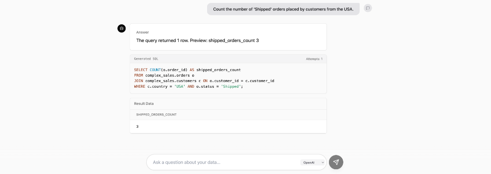
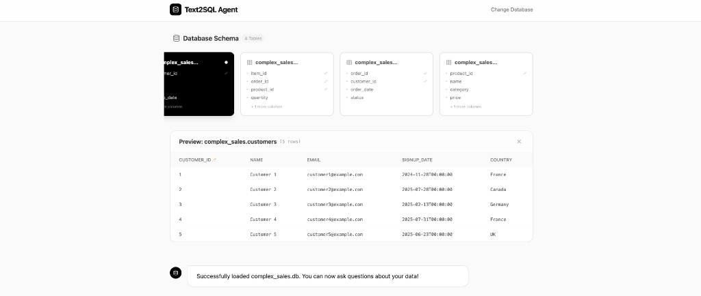
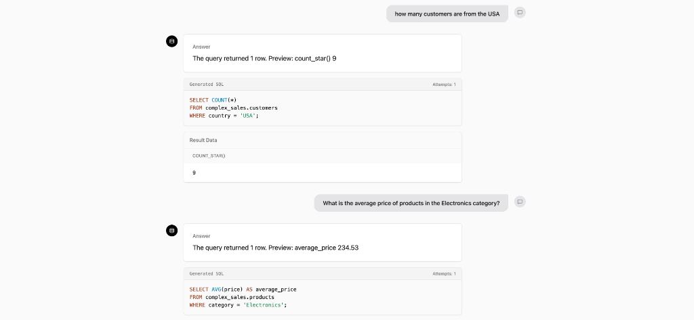

# 🤖 Text2SQL Agent

A powerful, modern, and secure **Text-to-SQL** agent that turns natural language questions into executable SQL queries. Built with **Python**, **DuckDB**, **FastAPI**, and **React**.



## ✨ Features

-   **🔌 Universal Data Support**: Works instantly with **CSV**, **JSON**, and **SQLite** files.
-   **🧠 Dual Intelligence**:
    -   **OpenAI (GPT-3.5/4)**: For complex reasoning and production-grade accuracy.
    -   **Local (T5)**: For offline, privacy-focused usage without API keys.
-   **🛡️ Enterprise Security**: Strict **read-only** enforcement (SELECT only) to prevent data modification.
-   **📊 Interactive Schema Visualization**: Automatically visualizes your database structure, relationships, and sample data.
-   **⚡ Modern UI**: A beautiful, responsive interface built with **React**, **Tailwind CSS**, and **Framer Motion**.
-   **🚀 High Performance**: Powered by **DuckDB** for lightning-fast query execution.

## 🚀 Quick Start

### Prerequisites

-   Python 3.8+
-   Node.js 16+
-   (Optional) OpenAI API Key for best results.

### 1. Clone & Install

```bash
git clone https://github.com/atharvayeola/text2sql_agent.git
cd text2sql_agent

# Install Python dependencies
pip install -e .[dev,llm]
pip install fastapi uvicorn openai python-dotenv duckdb pandas sqlglot

# Install Frontend dependencies
cd web
npm install
cd ..
```

### 2. Run the Demo

We provide a single script to generate test data and launch both the backend and frontend:

```bash
# (Optional) Set your OpenAI Key for smarter queries
export OPENAI_API_KEY="sk-..."

# Launch the app
chmod +x run_demo.sh
./run_demo.sh
```

The app will be available at **http://localhost:5173**.

## 📸 Screenshots

### 1. Schema Visualization
Upon uploading a database, the agent visualizes the tables and columns, allowing you to preview data instantly.



### 2. Natural Language Querying
Ask complex questions like *"Who are the top 5 customers by total spending?"* and get immediate answers with the generated SQL.



## 🏗️ Architecture

-   **Backend**: Python, FastAPI, DuckDB, SQLGlot.
-   **Frontend**: React, Vite, Tailwind CSS, Framer Motion.
-   **AI**: OpenAI API (GPT) or HuggingFace Transformers (T5).

## 🧪 Testing

Run the comprehensive test suite to verify functionality:

```bash
pytest
```

## 📄 License

MIT
