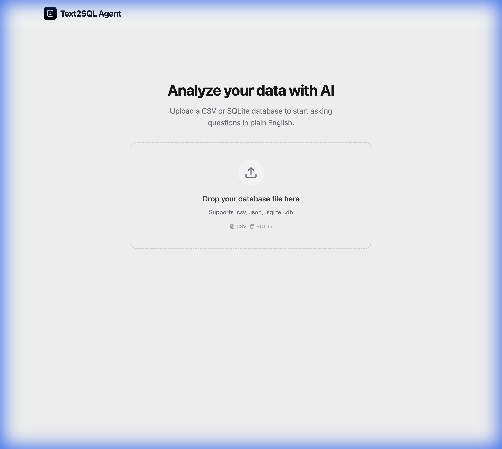
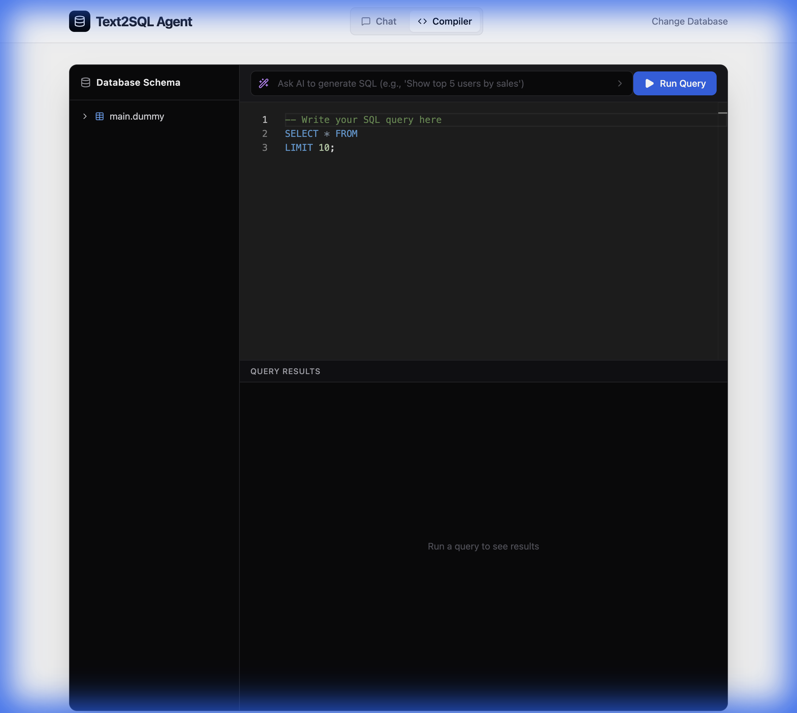

# 🤖 Text2SQL Agent

A powerful, modern, and secure **Text-to-SQL** platform that turns natural language questions into executable SQL queries. Now featuring a **professional SQL Compiler** with AI-powered assistance. Built with **Python**, **DuckDB**, **FastAPI**, and **React**.



## ✨ Features

-   **🔌 Universal Data Support**: Works instantly with **CSV**, **JSON**, and **SQLite** files.
-   **🧠 Dual Intelligence**:
    -   **OpenAI (GPT-3.5/4)**: For complex reasoning and production-grade accuracy.
    -   **Local (T5)**: For offline, privacy-focused usage without API keys.
-   **💻 Professional SQL Compiler**: Full-featured SQL editor with syntax highlighting, schema browser, and AI assistance.
-   **🤖 AI-Powered SQL Generation**: Generate SQL queries from natural language directly in the compiler.
-   **🛡️ Enterprise Security**: Strict **read-only** enforcement (SELECT only) to prevent data modification.
-   **📊 Interactive Schema Visualization**: Automatically visualizes your database structure, relationships, and sample data.
-   **⚡ Modern UI**: A beautiful, responsive interface built with **React**, **Tailwind CSS**, and **Framer Motion**.
-   **🚀 High Performance**: Powered by **DuckDB** for lightning-fast query execution.

## 🚀 Quick Start

### Prerequisites

-   Python 3.8+
-   Node.js 16+
-   (Optional) OpenAI API Key for AI-powered SQL generation.

### 1. Clone & Install

```bash
git clone https://github.com/atharvayeola/text2sql_agent.git
cd text2sql_agent

# Install Python dependencies
pip install -e .[dev,llm]
pip install fastapi uvicorn openai python-dotenv duckdb pandas sqlglot

# Install Frontend dependencies
cd web
npm install
cd ..
```

### 2. Run the Application

**Terminal 1 - Backend:**
```bash
cd /Users/ayeola/Downloads/text2sql_agent
uvicorn text2sql_agent.server:app --reload
```

**Terminal 2 - Frontend:**
```bash
cd /Users/ayeola/Downloads/text2sql_agent/web
npm run dev
```

The app will be available at **http://localhost:5173**.

## 📸 Screenshots

### 1. Chat Interface with Schema Visualization
Ask questions in natural language and see the generated SQL, results, and database schema.


### 2. SQL Compiler with AI Assistant
Write SQL queries with syntax highlighting, browse your schema, and use AI to generate queries on the fly.



## 🏗️ Architecture

-   **Backend**: Python, FastAPI, DuckDB, SQLGlot.
-   **Frontend**: React, Vite, Tailwind CSS, Framer Motion, Monaco Editor.
-   **AI**: OpenAI API (GPT) or HuggingFace Transformers (T5).

## 🧪 Testing

Run the comprehensive test suite to verify functionality:

```bash
pytest
```

## 📄 License

MIT
